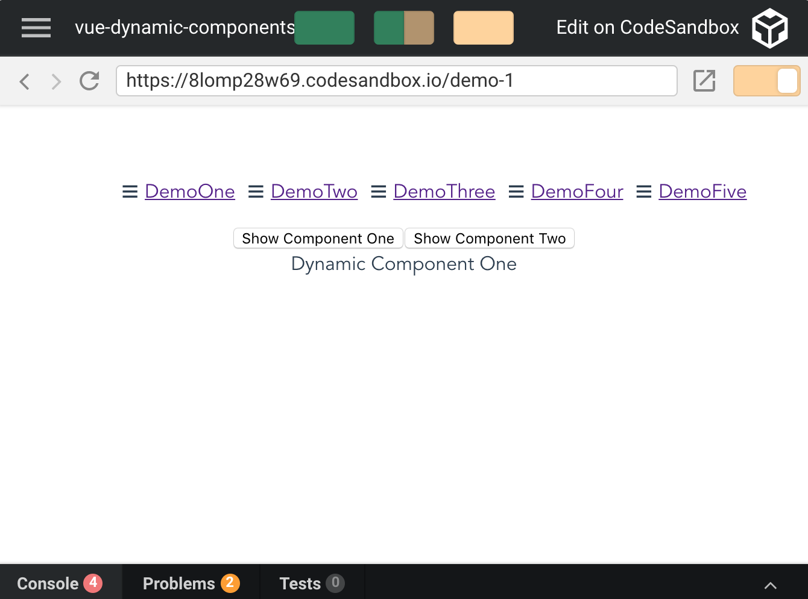
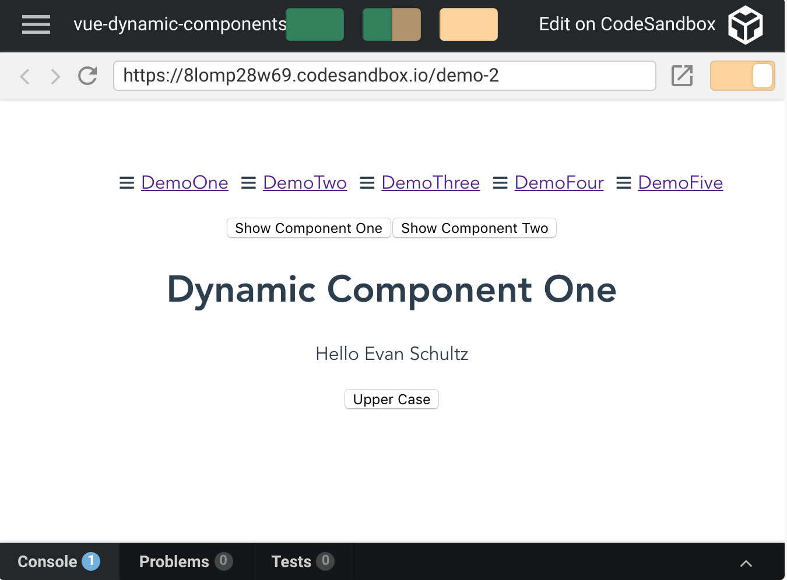
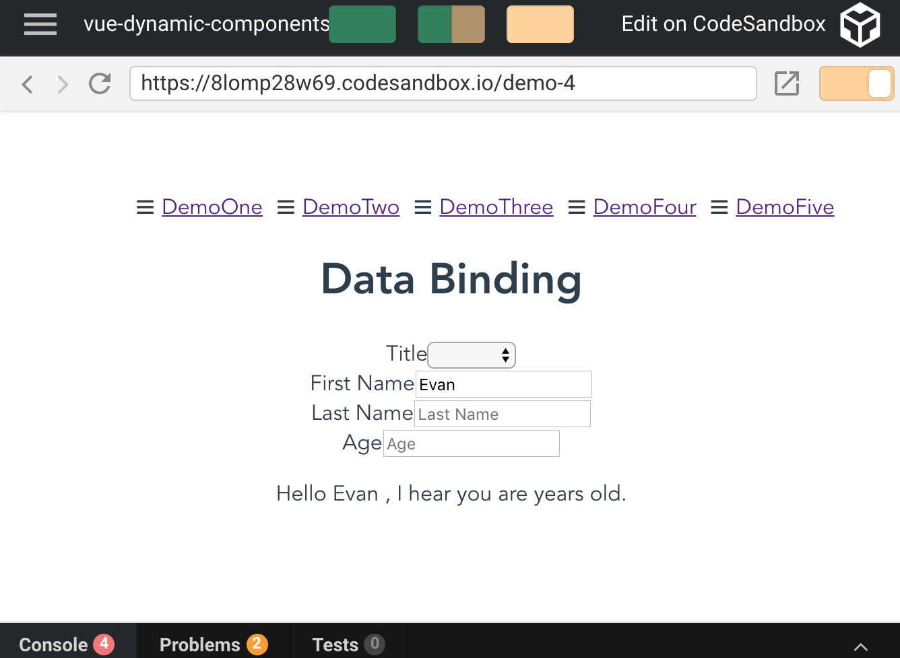
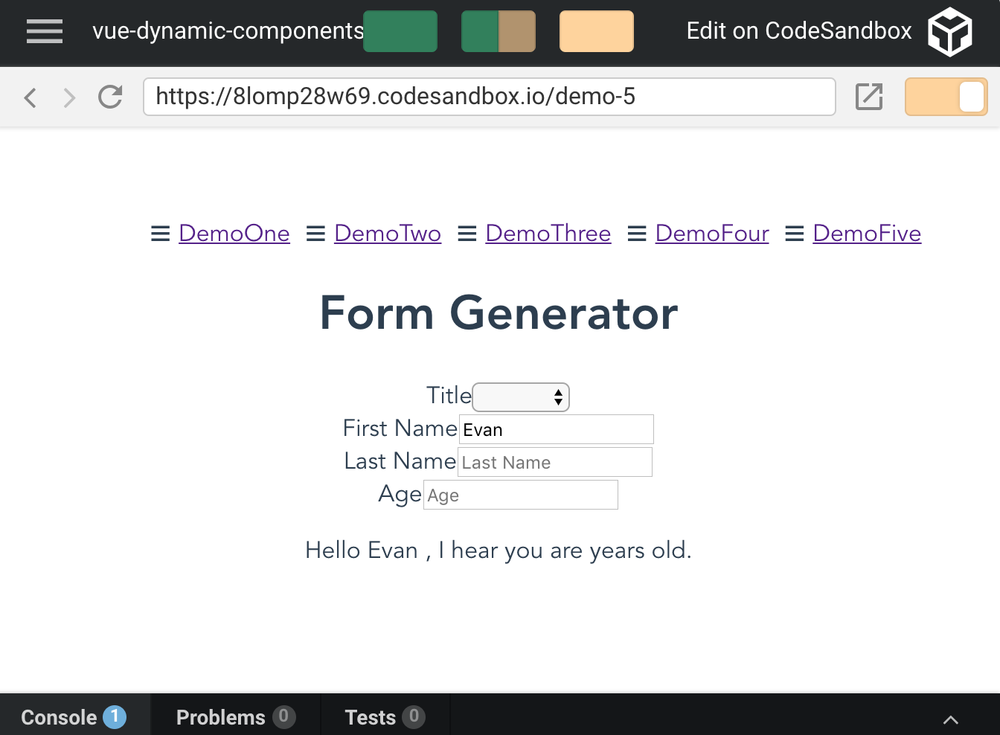

# [译]如何优雅地用Vue创建数据驱动的用户界面
> 翻译于[Evan Schultz](http://blog.rangle.io/author/evan/)的文章[Do it with Elegance: How to Create Data-Driven User Interfaces in Vue](http://blog.rangle.io/how-to-create-data-driven-user-interfaces-in-vue)


虽然我们通常知道在应用程序中构建大多数视图时需要哪些组件，但有时我们直到运行时才知道它们是什么。
这意味着我们需要基于应用程序状态，用户设置或来自API的响应来构建视图。
一个常见的情况是构建动态表单，其中所需的问题和组件由JSON对象配置，或者字段根据用户的答案进行更改。

所有现代的JavaScript框架都有处理动态组件的方法。这篇文章将向你展示如何在Vue.JS中实现它，它为上面的场景提供了一个非常优雅简单的解决方案。

一旦你看到用 Vue.JS实现多么简单，你可能会受到启发并且开始思考你以前从未考虑过的动态组件应用。

我们要先学会走才能学会跑，所以首先我将介绍动态组件的基础知识，然后深入讨论如何使用这些概念构建你自己的动态表单构造器。

## 基础

Vue有一个叫做 `<component>`的内置组件，你可以在[VueJS指南的动态组件]((https://cn.vuejs.org/v2/guide/components.html#动态组件))中了解完整的详细信息。

指南上写道：
> “你可以使用相同的挂载点并使用保留的元素在多个组件之间动态切换，并动态绑定到其is属性。”

这意味着切换组件可以向像下面这样简单：

```html
<component :is="componentType">  
```

让我们再多补充一点，看看发生了什么。我们将创建两个组件叫做DynamicOne 和 DynamicTwo - One和Two都是一样的，所以我不会重复展示这两个的代码。

```html
<template>  
  <div>Dynamic Component One</div>
</template>  
<script>  
export default {  
  name: 'DynamicOne',
}
</script>
```

对于一个能够在它们之间切换的快速示例，我们将在App.vue中设置我们的组件。

```javascript
import DynamicOne from './components/DynamicOne.vue'  
import DynamicTwo from './components/DynamicTwo.vue'

export default {  
  name: 'app',
  components: {
    DynamicOne, DynamicTwo
  },
  data() {
    return {
      showWhich: 'DynamicOne'
    }
  }
}
```

注意：`showWhich` data属性的值是字符串`DynamicOne`-这是在组件的`components`对象中创建的属性名。

在我们的模板中，我们将设置两个按钮来切换这两个动态组件。

```html
<button @click="showWhich = 'DynamicOne'">Show Component One</button>  
<button @click="showWhich = 'DynamicTwo'">Show Component Two</button>

<component :is="showWhich"></component>  
```

点击这两个按钮将会交换DynamicOne和DynamicTwo

[](https://codesandbox.io/embed/github/e-schultz/vue-dynamic-components/tree/master/?initialpath=%2Fdemo-1&view=preview)

看到这你也许会想，“那又怎样呢？这很方便-但我用`v-if`一样很简单”。

当你意识到`<component>`像其他任何组件一样工作时，这个例子就开始发挥作用了，并且它可以与诸如`v-for`之类的东西结合用于迭代集合，或者将`is`绑定到input的属性、data属性或计算属性上。


## 关于props和事件

组件不是孤立地存在，它们需要一种方式与周围的世界交流。在Vue中，是通过props和事件实现的。

你可以用与其他组件一样的方式在动态组件上设置属性和绑定事件，并且如果如果加载的组件不需要该属性，Vue也不会报未知属性的错误。

让我们来修改我们的组件来展示一个问候。一个组件会接受`firstName`和`lastName`，另一个会接受`firstName`、`lastName`和`title`。

关于事件，我们将在`DynamicOne`中添加一个按钮，它将发射一个叫做"upperCase"的事件，在`DynamicTwo`中，这个按钮将发射一个叫做"lowerCase"的事件。

把它们组合在一起，修改后的动态组件看起来像这样：

```html
<component  
  :is="showWhich" 
  :firstName="person.firstName"
  :lastName="person.lastName"
  :title="person.title"
  @upperCase="switchCase('upperCase')"
  @lowerCase="switchCase('lowerCase')">
</component>  
```

不是所有的属性或事件都需要在我们正在切换的动态组件上定义。

## 你需要预先知道props吗？

在这一点上，你可能会想知道，“如果组件是动态的，并且不是所有的组件都需要知道每个可能的props，那我需要预先知道props并在模板中声明它们吗？”

谢天谢地，答案是否定的。Vue提供了一个快捷方式，你可以用`v-bind`将一个对象的所有key都绑定到组件的props上。

这简化了模板：

```html
<component  
  :is="showWhich" 
  v-bind="person"
  @upperCase="switchCase('upperCase')"
  @lowerCase="switchCase('lowerCase')">
</component>  
```
[](https://codesandbox.io/embed/github/e-schultz/vue-dynamic-components/tree/master/?initialpath=%2Fdemo-2&view=preview)

## 关于表单

既然我们拥有动态组件的构建块，那么我们就可以开始在其他Vue基础上构建表单生成器了。

我们从一个基本的表单模式开始 - 一个描述表单的字段，标签，选项等的JSON对象。首先，我们将解释：

- 文本和数字输入域
- 一个选项列表

初始模式是这样的：

```javascript
schema: [{  
          fieldType: "SelectList",
          name: "title",
          multi: false,
          label: "Title",
          options: ["Ms", "Mr", "Mx", "Dr", "Madam", "Lord"]
        },
        {
          fieldType: "TextInput",
          placeholder: "First Name",
          label: "First Name",
          name: "firstName"
        },
        {
          fieldType: "TextInput",
          placeholder: "Last Name",
          label: "Last Name",
          name: "lastName"
        },
        {
          fieldType: "NumberInput",
          placeholder: "Age",
          name: "age",
          label: "Age",
          minValue: 0
        }
      ]
```

非常简单 - 标签，占位符等 - 选择列表列出了可能的选项。在这个例子中，我们将保持这些组件的简单实现。

*TextInput.vue - template*

```html
<div>  
  <label>{{label}}</label>
  <input type="text"
    :name="name"
    placeholder="placeholder">
</div>  
```

*TextInput.vue - script*

```javascript
export default {  
  name: 'TextInput',
  props: ['placeholder', 'label', 'name']
}
```

*SelectList.vue - template*

```html
  <div>
    <label>{{label}}</label>
    <select :multiple="multi">
      <option v-for="option in options"
              :key="option">
        {{option}}
      </option>
    </select>
  </div>
```
*SelectList.vue - script*

```javascript
export default {  
  name: 'SelectList',
  props: ['multi', 'options', 'name', 'label']
}
```

要根据此模式生成表单，添加以下内容：

```html
<component 
  v-for="(field, index) in schema"  
  :key="index"
  :is="field.fieldType"
  v-bind="field">
</component>  
```

表单效果如下：

[](https://codesandbox.io/embed/github/e-schultz/vue-dynamic-components/tree/master/?initialpath=%2Fdemo-4&view=preview)

## 数据绑定

如果生成表单但不绑定数据，它是否非常有用？可能不会。我们目前正在生成一个表单，但没有办法将数据绑定到它。你的第一反应可能是为模式添加一个`value`属性，并且在组件中使用`v-model`，如下所示：

```html
<input type="text"  
  :name="name"
  v-model="value"
  :placeholder="placeholder">
```
这种方法存在一些潜在的缺陷，但我们最关心的是Vue会给我们一个错误/警告：

```html
[Vue warn]: Avoid mutating a prop directly since the value will be overwritten whenever the parent component re-renders. Instead, use a data or computed property based on the prop's value. Prop being mutated: "value"

found in

---> <TextInput> at src/components/v4/TextInput.vue
       <FormsDemo> at src/components/DemoFour.vue
         <App> at src/App.vue
           <Root>
```

尽管Vue确实提供了帮助器，使组件状态的双向绑定更容易，但框架仍然偏向于单向数据流。我们试图直接在组件内修改父组件的数据，所以Vue会向我们发出警告。


仔细看看`v-model`，它没有太多的魔力，所以让我们按照[Vue的表单输入组件指南](https://cn.vuejs.org/v2/guide/components-custom-events.html#%E5%B0%86%E5%8E%9F%E7%94%9F%E4%BA%8B%E4%BB%B6%E7%BB%91%E5%AE%9A%E5%88%B0%E7%BB%84%E4%BB%B6)中的描述来分解它。

```html
<input v-model="something"> 
```

和下面相同的

```html
<input  
  v-bind:value="something"
  v-on:input="something = $event.target.value">
```

随着魔法揭示，我们想要完成的是：

- 让父组件将值提供给子组件
- 让父组件知道值已更新

我们通过绑定到`value`并发出`@input`事件来通知父组件值已经发生变化，从而完成此操作。

来看看我们的`TextInput`组件

```html
 <div>
  <label>{{label}}</label>
  <input type="text"
    :name="name"
    :value="value"
    @input="$emit('input',$event.target.value)"
    :placeholder="placeholder">
  </div>
```

由于父组件负责提供该值，因此它也负责处理绑定到它自己的组件状态。为此，我们可以在组件上使用`v-model`：

*FormGenerator.vue - template*

```html
<component v-for="(field, index) in schema"
  :key="index"
  :is="field.fieldType"
  v-model="formData[field.name]"
  v-bind="field">
</component>  
```

注意我们如何使用`v-model ="formData [field.name]"`。我们需要在这个data属性上设置一个对象：

```javascript
export default {  
  data() {
  return {
    formData: {
      firstName: 'Evan'
    },
}
```

我们可以将对象留空，或者如果我们有一些我们想要设置的初始字段值，我们可以在这里指定它们。

现在我们已经完成了生成表单的工作，并且发现这个组件承担了相当多的责任。虽然这不是复杂的代码，但如果表单生成器本身是一个可复用组件，那将会很好。

## 打造可复用的生成器

对于这个表单生成器，我们希望将模型作为一个prop传递给它，并且能够在组件之间建立数据绑定。

用生成器的模板是这样：

*GeneratorDemo.vue - template*

```html
<form-generator :schema="schema" v-model="formData">  
</form-generator>  
```

这相当多地简化了父组件。它只关心`FormGenerator`，而不关心每个可用的输入类型、连接的事件等等。

接下来，创建一个名为`FormGenerator`的组件。这几乎是复制粘贴最初的代码然后进行一些微小但关键的调整：

- 将`v-modle`改为`:value`，然后用`@input`处理事件
- 添加`value`和`schema` 到props上
- 实现 `updateForm`方法

FormGenerator组件如下：

*FormGenerator.vue - template*

```html
<component 
  v-for="(field, index) in schema"
  :key="index"
  :is="field.fieldType"
  :value="formData[field.name]"
  @input="updateForm(field.name, $event)"
  v-bind="field">
</component>
```
*FormGenerator.vue - template*

```javascript
import NumberInput from '@/components/v5/NumberInput'  
import SelectList from '@/components/v5/SelectList'  
import TextInput from '@/components/v5/TextInput'

export default {  
  name: "FormGenerator",
  components: { NumberInput, SelectList, TextInput },
  props: ['schema', 'value'],
  data() {
    return {
      formData: this.value || {}
    };
  },
  methods: {
    updateForm(fieldName, value) {
      this.$set(this.formData, fieldName, value);
      this.$emit('input', this.formData)
    }
  }
};
```

由于`formData`属性并不知道我们传入的每一个可能的字段，我们使用`this.$set`，这样Vue的响应系统就可以跟踪它的任何变化，并允许`FormGenerator`组件跟踪它自己的内部状态。

现在我们有了一个基本的、可复用的表单生成器。

在组件内使用它：

*GeneratorDemo.vue - template*

```html
<form-generator :schema="schema" v-model="formData">  
</form-generator>  
```

*GeneratorDemo.vue - script*

```javascript
import FormGenerator from '@/components/v5/FormGenerator'

export default {  
  name: "GeneratorDemo",
  components: { FormGenerator },
  data() {
    return {
      formData: {
        firstName: 'Evan'
      },
      schema: [{ /* .... */ },
}
```

[](https://codesandbox.io/embed/github/e-schultz/vue-dynamic-components/tree/master/?initialpath=%2Fdemo-5&view=preview)

现在你已经看到了表单生成器如何利用Vue的基础动态组件创建一些高度动态的、数据驱动的UI。我鼓励你好好研究下[GitHub](https://github.com/e-schultz/vue-dynamic-components)上的示例代码或者在[CodeSanbox](https://codesandbox.io/s/github/e-schultz/vue-dynamic-components/tree/master/?initialpath=%2Fdemo-5&module=%2Fsrc%2Fcomponents%2FDemoFive.vue)上实践。如果你有任何问题或者想聊一聊，可以随时通过 [Twitter](https://twitter.com/@e_p82), [Github](http://blog.rangle.io/how-to-create-data-driven-user-interfaces-in-vue/github.com/e-schultz), 或[邮件](mailto://evan@rangle.io)联系我。
